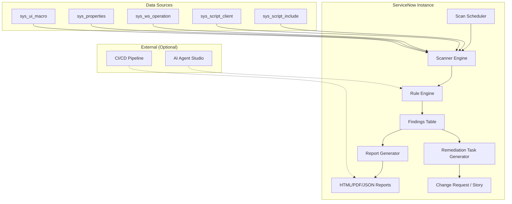

# Architecture Summary: ServiceNow-ADIS

**Product:** Australia Deprecation Impact Scanner  
**Scope Prefix:** `x_adis`  
**Release Target:** Zurich → Australia upgrade cycle  
**Author:** Vladimir Kapustin  
**License:** AGPL-3.0-only  

---

## Executive Summary

ServiceNow-ADIS is a production-grade scoped application that audits ServiceNow instances for deprecated APIs, removed tables, and breaking changes between the Zurich and Australia releases. It provides automated scanning, intelligent risk scoring, and remediation task generation—eliminating weeks of manual upgrade planning.

The application operates entirely within the ServiceNow security boundary, using native GlideRecord APIs to scan script tables, system properties, UI macros, and configuration items. Findings are stored in first-class application tables with full audit trails, enabling teams to track remediation progress from discovery through resolution.

---

## System Architecture



---

## Core Components

### 1. Scanner Engine (`AustraliaDeprecationImpactScanner`)

The primary scanning component that executes regex-based pattern matching across configured tables.

**Key Methods:**
- `scan()` — Full instance scan across all configured tables
- `scanIncremental(sinceDate)` — Scan only records modified since a given date
- `getTableConfig()` — Load target table configuration from `x_adis_scan_config`

**Execution Flow:**
1. Load scan configuration from `x_adis_scan_config`
2. For each target table, query records with optional filters
3. Extract script/content fields and normalize line endings
4. Pass each script block to the Rule Engine for evaluation
5. Store findings in `x_adis_finding` with severity, location, and remediation hint
6. Update scan run statistics in `x_adis_scan_run`

### 2. Rule Engine (`AustraliaDeprecationImpactScannerRuleEngine`)

Maintains a versioned catalog of deprecation rules mapped to release transitions.

**Key Methods:**
- `evaluate(scriptText)` — Return all matching rules for a given script
- `getReplacement(ruleId)` — Fetch the recommended replacement API or pattern
- `loadRules(sourceRelease, targetRelease)` — Filter rules by release pair

**Rule Schema (`x_adis_deprecation_rule`):**
| Field | Type | Description |
|-------|------|-------------|
| `name` | String | Human-readable rule name |
| `pattern` | String | Regex pattern to match |
| `source_release` | String | e.g., "Zurich" |
| `target_release` | String | e.g., "Australia" |
| `severity` | Choice | P0 (Critical), P1 (High), P2 (Medium), P3 (Low) |
| `replacement_hint` | String | Suggested fix or API replacement |
| `documentation_url` | String | Link to official ServiceNow docs |

### 3. Report Generator (`AustraliaDeprecationImpactScannerReportGenerator`)

Transforms finding records into human-readable and machine-consumable formats.

**Key Methods:**
- `generateHTML(scanRunId)` — Executive summary with charts and drill-down tables
- `generateJSON(scanRunId)` — Machine-readable export for CI/CD pipelines
- `generatePDF(scanRunId)` — Print-ready report with cover page and table of contents

### 4. Remediation Task Generator (`AustraliaDeprecationImpactScannerTaskGenerator`)

Automatically creates remediation work items in ServiceNow's work management tables.

**Key Methods:**
- `createChangeRequest(findingSysId)` — Link finding to a Change Request
- `createStory(findingSysId, projectId)` — Create Agile Development story
- `bulkCreate(selectedFindings, targetType)` — Batch task creation

---

## Data Model

### Application Tables

| Table | Purpose | Key Fields |
|-------|---------|------------|
| `x_adis_scan_config` | Target tables and scan filters | `table_name`, `field_list`, `filter_condition`, `active` |
| `x_adis_scan_run` | Scan execution history | `started_at`, `completed_at`, `status`, `records_scanned`, `findings_count` |
| `x_adis_finding` | Individual deprecation findings | `scan_run`, `rule`, `table_name`, `record_sys_id`, `field_name`, `line_number`, `severity`, `remediation_task` |
| `x_adis_deprecation_rule` | Rule catalog | `name`, `pattern`, `source_release`, `target_release`, `severity`, `replacement_hint` |
| `x_adis_log` | Audit log for troubleshooting | `level`, `message`, `source`, `timestamp` |

---

## Integration Points

### Inbound (None)
The application is designed for zero inbound connections, minimizing attack surface.

### Outbound (Optional)
| Integration | Purpose | Configuration |
|-------------|---------|---------------|
| AI Agent Studio | Generative remediation hints | Requires Australia release + AI Agent plugin |
| REST Message | Push findings to external SIEM/CI/CD | Configure endpoint in `x_adis_integration_config` |
| Email | Send report to stakeholders | Use native ServiceNow email notifications |

---

## Security Model

- **Scoped Application:** All application code runs in the `x_adis` scope
- **ACLs:** Read/write access controlled by `x_adis_admin` and `x_adis_user` roles
- **Data Boundary:** No data leaves the instance unless explicitly configured via outbound REST
- **Audit Trail:** All scan runs and finding modifications are logged in `x_adis_log`

---

## Performance Characteristics

| Metric | Target | Notes |
|--------|--------|-------|
| Full scan (10k records) | < 5 minutes | Async execution via Scheduled Job |
| Incremental scan (100 records) | < 30 seconds | Filtered by `sys_updated_on` |
| Report generation | < 10 seconds | Cached result sets |
| Memory footprint | < 50 MB | Streaming GlideRecord queries with `setLimit()` |

---

## Deployment Architecture

```
┌─────────────────────────────────────────────────────────────┐
│                   ServiceNow Instance                        │
│  ┌───────────────────────────────────────────────────────┐  │
│  │              x_adis Scoped Application                 │  │
│  │  ┌─────────────┐  ┌─────────────┐  ┌───────────────┐  │  │
│  │  │   Scanner   │  │ Rule Engine │  │   Reporter    │  │  │
│  │  └─────────────┘  └─────────────┘  └───────────────┘  │  │
│  │  ┌─────────────────────────────────────────────────┐  │  │
│  │  │           Application Tables (x_adis_*)          │  │  │
│  │  └─────────────────────────────────────────────────┘  │  │
│  └───────────────────────────────────────────────────────┘  │
└─────────────────────────────────────────────────────────────┘
```

---

## Release Alignment

This application is specifically designed for the **Zurich → Australia** upgrade cycle, addressing:

1. **Deprecated APIs:** `GlideDateTime.getDisplayValueInternal()`, `GlideRecord.getRecordClassName()`, legacy `GlideFilter` patterns
2. **Removed Tables:** `alm_hardware_consumed`, `cmdb_ci_computer` (replaced by CSDM-aligned tables)
3. **UI Framework Shifts:** Legacy UI16 macros replaced by Next Experience components
4. **Workflow Studio Migration:** Flow Designer replacements for legacy Workflow Editor

---

## Future Extensions

- **v1.1:** Australia → Washington DC deprecation rules
- **v1.2:** Cross-instance comparison dashboard (dev vs. test vs. prod)
- **v1.3:** Automated fix application (with approval workflow)
- **v2.0:** Machine learning-based false positive reduction
